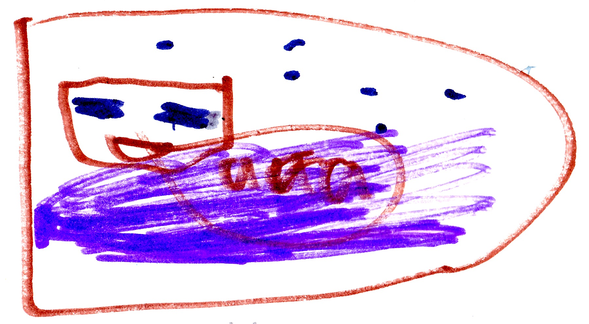

# Rise of a Villain

My team decided to have a victory party for Herobrine's death, but someone had other ideas.

In the Nether...

{width=400px}

King Ghast decided to fight for evil again. He went to The End to find Cindy, the witch, Will, the wither, and Elder, the Elder guardian. He talked about his plan and they said, "With a leader like you, we can win -- you are now Emperor Ghast!"

Meanwhile...

My team had to go to the mine that is close to my destroyed base. I tripped on a rock and fell down to a hidden base made by my dad many years ago. My dad as a ghost appeared and said, "I see you found my lab -- come on let me take you on a tour. On the way Dad said, "I'm sorry for almost killing you. I was turned into Herobrine but now I can remember everything."

I felt sad and said, "I had no idea."

The ghost said, "I fell into a bad magic pool. That's how I become Herobrine."

Dad showed me the library, treasure room and the weapon room. Dad said, "I never powered the weapons." Then I grabbed the command block that I had found at the command block tower during my earlier adventures. "Perfect," Dad said. 

I placed the command block in the missing spot and it worked. The command block powered all the weapons.

