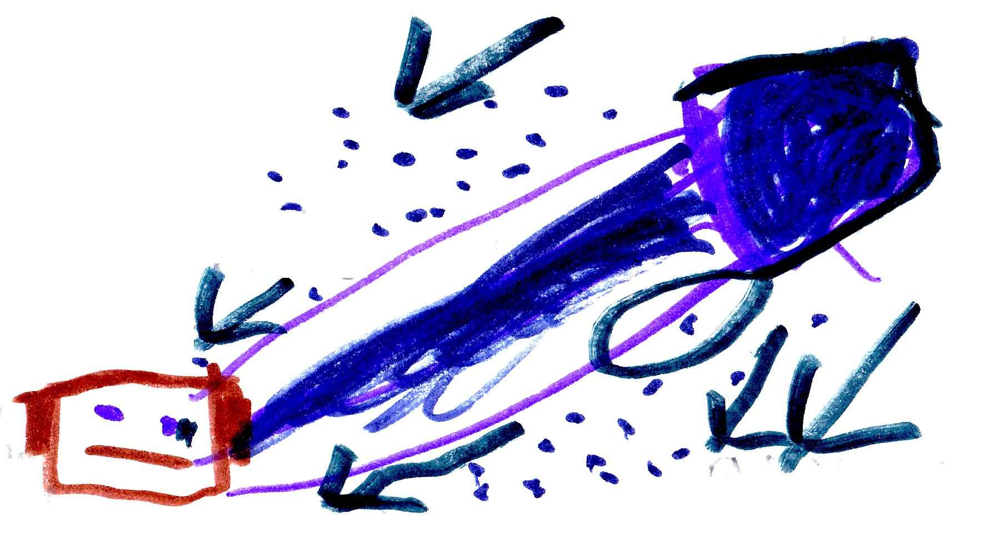

# Party!

I left the secret lab and found the party gear I needed in the mine. I went back to my base with the party gear. Three villages joined. We danced, ate, played, and then King Ghast popped out of nowhere. The villages were damaged in King Ghast's attack. Many of the villagers were injured. Boom! Boom!! Boom!!! Booom!!!

{width=500px}

A building had collapsed on Bob. I pulled rocks off and there was Bob. We finished the fight but Bob didn't make it; instead he died. During the fight the bad guys got Herobrine's skull. 

In the end...

{width=300px}

Cindy threw 100 gallons of bad magic on Herobrine's skull. But nothing happened. When Cindy was finished she said, "Come back to me, Herobrine." And then she heard him whisper back, "I will, I will."

