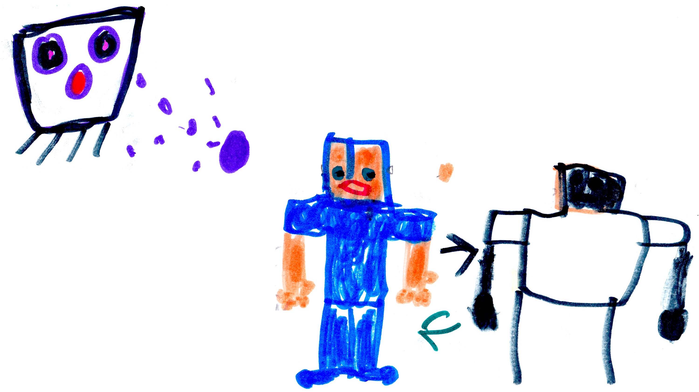

# The Fight

A few hours later...

I felt evil getting stronger then a portal opened in the base's front yard, and King Ghast and all his minion ghasts came out. I got 3 weapons from the lab. They were a TNT thrower, a super jumper machine and a super speed machine. I yelled at the ghasts as I shot them, "Get some TNT and you and you. You ghasts all get TNTs." Felix used the jumping machine to jump high and hit the flying Ghasts.

{width=400px}

Aden used the speed machine to make tools, armor, and weapons super fast. I was talking about a plan when...BOOM! I was shot with a bad magic ball and I became evil.

"Give him a good magic jar" said Felix and then threw one on me.

{width=100px} {width=200px}

We eventually scared off King Ghast. 

In the end...

100 bad magic jars were sent by his mining minions to King Ghast, and he decided to experiment with them. He built an energy tracker which tracks energy through other realities. 

Meanwhile...

That night I had a dream that Herobrine was alive, and he was a robot. "Come and get me" he said. I woke up. "What happened?" I wondered. 

{width=300px}

My ghost Dad reappeared and said, "You saw the future". 

"How?" I said. 

I felt as much energy in my body as a time machine has, and I went to bed. The next morning I talked to my friends about Herobrine coming back and no one believed me, but my ghost Dad and Malek.

We thought King Ghast was up to something, so we sent Malek to find out what he was doing.

