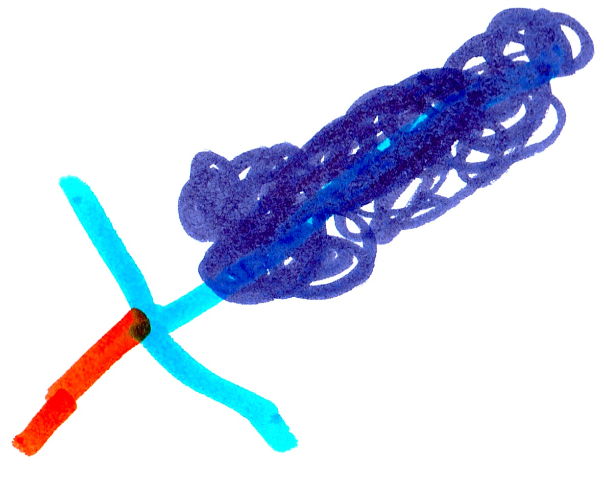

# The Big Battle

Cindy, Will, Elder, and King Ghast went to find me. When they did find me, I was standing right next to Elder with my sword. KABLAM!!! Elder was dead.

King Ghast was shooting bad magic balls everywhere. I was captured and put in a cage. Then everyone else came out of the base to fight King Ghast and the others. Felix broke me out of the cage, and we all started fighting. The fight lasted for 1 hour and 45 minutes. At the end, all my friends had been captured and put in the cage. I was the only one left. I said, "Bring it on!" Some magic got on my sword from King Ghast's fireball. 

{width=100px}

Luckily that bad magic did not touch my hand, and I used it to kill King Ghast. Will ran away. Suddenly a portal opened and Cindy ran away. I said, "I'm too late!"

{width=100px}

A portal appeared and Herobrine stepped out. He was huge with a robot body and a skull head. On his shoulders were two bad magic jars. Herobrine said, 

**"I'm back and you won't stop me!"**

# The End {-}