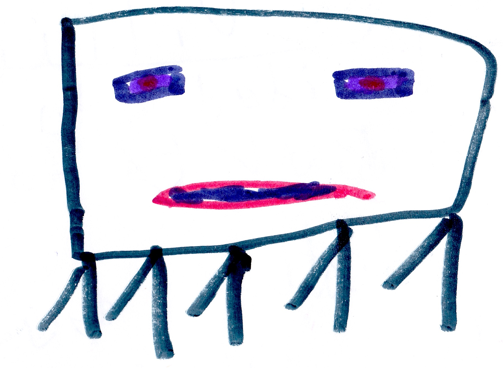

--- 
title: "King Ghast's Revenge"
subtitle: "Book 3"
author: "Beckett Stephens"
date: "`r Sys.Date()`"
site: bookdown::bookdown_site
documentclass: book
classoption: oneside
description: "My book about adventures in a video game named Minecraft."
cover-image: "img/00-ghast.jpg"
favicon: "img/mc-favicon.ico"
github-repo: "nwstephens/king-ghast"
---

# Preface {-}

{width=300px}

This book is about my adventures in a video game named Minecraft.

# About the Author {-}

Beckett Stephens is an aspiring author and illustrator. *King Ghast's Revenge* is his second published work. Beckett also loves Minecraft, Lego's, and Transformers, as well as making up endless stories while he walks. He currently lives in Maryland with his younger brother.

# Acknowledgements {-}

Thanks to Mom for helping me edit *King Ghast's Revenge*. And thanks to Dad for helping me publish it online. Also, thanks to Minecraft community for the inspiration that helped me make this book.
